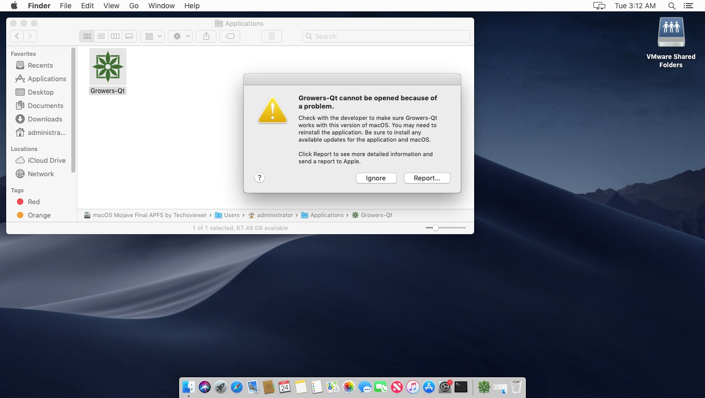
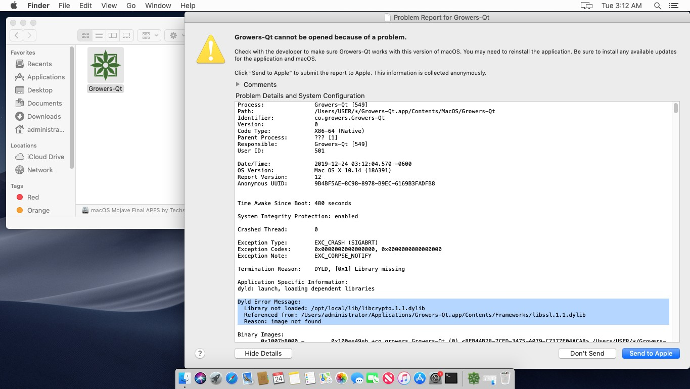

How to fix OSX library paths
============================

What is this all about?
-----------------------

When you double click on the Growers-Qt app and you get an error dialog:



Click on the `Report...` button to expand debug information:



As you can see in the highlighted area, an "Image not found" error was thrown:

```
Dyld Error Message:
 Library not loaded: /opt/local/lib/libcrypto.1.1.dylib
 Referenced from: /Users/administrator/Applications/Growers-Qt.app/Contents/Frameworks/libssl.1.1.dylib
 Reason: image not found
```

This error is caused by an unprepared dependency, `libssl.1.1.dylib` on this case.

You need to change the path of the library using `install_name_tool`, and you can
show path infos with `otool`.

Digging deeper in MacOS dependencies
------------------------------------

At any time, you can take a look at the library paths by using `otool` over the app binary, E.G.:

```sh
cd $HOME/Devel/GrowersCoin/Growers-Qt.app/Contents/MacOS
otool -L Growers-Qt
```

Output example:

```sh
Growers-Qt:
       /System/Library/Frameworks/Foundation.framework/Versions/C/Foundation (compatibility version 300.0.0, current version 1575.17.0)
       /System/Library/Frameworks/ApplicationServices.framework/Versions/A/ApplicationServices (compatibility version 1.0.0, current version 50.1.0)
       /System/Library/Frameworks/AppKit.framework/Versions/C/AppKit (compatibility version 45.0.0, current version 1671.60.107)
       @executable_path/../Frameworks/libdb_cxx-4.8.dylib (compatibility version 0.0.0, current version 0.0.0)
       @executable_path/../Frameworks/QtGui.framework/Versions/4/QtGui (compatibility version 4.8.0, current version 4.8.7)
       @executable_path/../Frameworks/QtCore.framework/Versions/4/QtCore (compatibility version 4.8.0, current version 4.8.7)
       @executable_path/../Frameworks/QtNetwork.framework/Versions/4/QtNetwork (compatibility version 4.8.0, current version 4.8.7)
       /usr/lib/libc++.1.dylib (compatibility version 1.0.0, current version 400.9.4)
       /usr/lib/libSystem.B.dylib (compatibility version 1.0.0, current version 1252.250.1)
       /System/Library/Frameworks/CoreFoundation.framework/Versions/A/CoreFoundation (compatibility version 150.0.0, current version 1575.17.0)
       /System/Library/Frameworks/CoreServices.framework/Versions/A/CoreServices (compatibility version 1.0.0, current version 946.0.0)
       /usr/lib/libobjc.A.dylib (compatibility version 1.0.0, current version 228.0.0)
```

At the example above, the non-system libraries should have relative paths (`@executable_path/../Frameworks/`).
Any absolute path pointing to `/opt/local` or `/Users/whatever` then, that reference needs to be updated.

To check if an element has an incorrect path, you use `otool -L <file>`, then use
`install_name_tool -change <search> <replace> <file>` to fix the path.

Replacement examples
--------------------

During initial tests on the GrowersCoin release prior the publication of this document,
we faced issues with path libraries because `macdeployqt` didn't add everything:
it missed copying `QtNetwork` and other SSL library files.

So it was manually copied into the app directory:

```sh
cd $HOME/Devel/GrowersCoin/Growers-Qt.app/Contents/Frameworks/
cp -R /opt/local/libexec/qt4/Library/Frameworks/QtNetwork.framework ./
cp /opt/local/lib/libz.1.dylib ./
cp /opt/local/lib/libssl.1.1.dylib ./
cp /opt/local/lib/libcrypto.1.1.dylib ./
```

Then checking the QtNetwork binary to search and replace paths:

```sh
cd $HOME/Devel/GrowersCoin/Growers-Qt.app/Contents/Frameworks/QtNetwork.framework/Versions/4/
otool -L QtNetwork
```

We've got the next issues (lines marked with `>>>>>>>`):

```
QtNetwork:
        @executable_path/../Frameworks/QtNetwork.framework/Versions/4/QtNetwork (compatibility version 4.8.0, current version 4.8.7)
        @executable_path/../Frameworks/QtCore.framework/Versions/4/QtCore (compatibility version 4.8.0, current version 4.8.7)
>>>>>>> /opt/local/lib/libz.1.dylib (compatibility version 1.0.0, current version 1.2.11)
        /System/Library/Frameworks/SystemConfiguration.framework/Versions/A/SystemConfiguration (compatibility version 1.0.0, current version 963.255.3)
        /System/Library/Frameworks/CoreFoundation.framework/Versions/A/CoreFoundation (compatibility version 150.0.0, current version 1575.17.0)
        /System/Library/Frameworks/CoreServices.framework/Versions/A/CoreServices (compatibility version 1.0.0, current version 946.0.0)
>>>>>>> /opt/local/lib/libssl.1.1.dylib/libssl.1.1.dylib (compatibility version 1.1.0, current version 1.1.0)
>>>>>>> /opt/local/lib/libssl.1.1.dylib/libcrypto.1.1.dylib (compatibility version 1.1.0, current version 1.1.0)
        /usr/lib/libc++.1.dylib (compatibility version 1.0.0, current version 400.9.4)
        /usr/lib/libSystem.B.dylib (compatibility version 1.0.0, current version 1252.250.1)
        /System/Library/Frameworks/CFNetwork.framework/Versions/A/CFNetwork (compatibility version 1.0.0, current version 978.0.7)
```

Remember: any absolute path pointing to `/opt/local` or `/Users/whatever` is wrong.
The fix was running the next commands:

For fixing `libz`:
```
install_name_tool -change /opt/local/lib/libz.1.dylib \
    @executable_path/../Frameworks/libz.1.dylib \
    QtNetwork
```

For fixing `libssl`:
```
install_name_tool -change /opt/local/lib/libssl.1.1.dylib \
    @executable_path/../Frameworks/libssl.1.1.dylib \
    QtNetwork
```

For fixing `libcrypto`:
```    
install_name_tool -change /opt/local/lib/libcrypto.1.1.dylib \
    @executable_path/../Frameworks/libcrypto.1.1.dylib \
    QtNetwork
```

We hope this information helps you understand how Mac applications are packaged.
