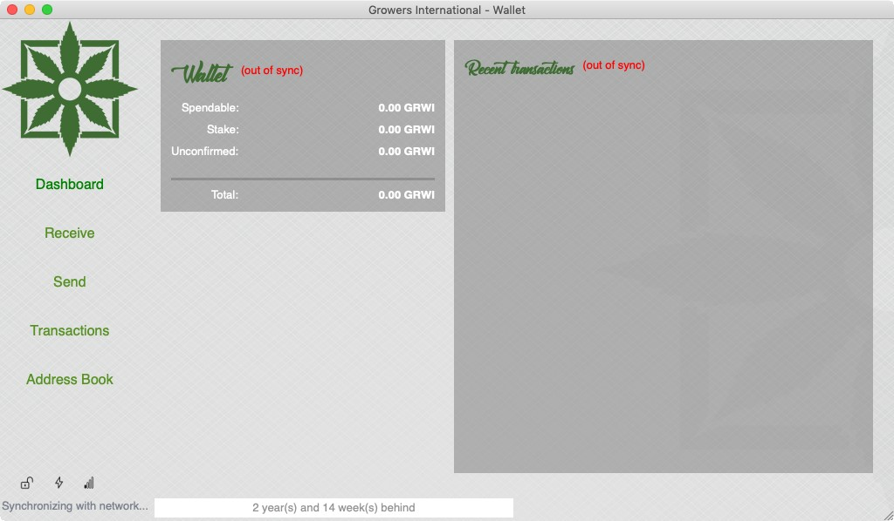

GrowersCoin desktop wallet build instructions
==========================

Mac OS X
--------



Building the QT wallet on a Mac will be really tricky, so pay atention.

1. First of all, go to the [OSX build instructions](build-osx.md) and take all steps except the final one
   (actually building the `growersd` file).
   
   Once you've compiled leveldb, type the next lines on the command window:
   
   ```sh
   BUILDING_DIR=$HOME/Devel/build
   cd $HOME/Devel/growers
   ```
   
2. On the terminal window, install Qt4 using Macports:

   ```sh
   sudo port install qt4-mac
   ```
   
   Let's make a copy of the libraries, we'll need them later:
   
   ```sh
   sudo mkdir /opt/local/Library/Frameworks
   sudo cp -R /opt/local/libexec/qt4/Library/Frameworks/* /opt/local/Library/Frameworks
   ```

3. Do this **once**:
   
   To avoid the compilation breaking with the next error:
   
   ```
   /Users/YOUR_USERNAME/Devel/build/include/boost/type_traits/detail/has_binary_operator.hp:50: Parse error at "BOOST_JOIN"
   make: *** [build/rpcconsole.moc] Error 1
   ```
   
   You will need to edit the `has_binary_operator.hpp` file by running:
   
   ```sh
   nano /mnt/mxe/usr/i686-w64-mingw32.static/include/boost/type_traits/detail/has_binary_operator.hpp
   ```
   
   Once opened, add this line **at the top of the file**:
   
   ```cpp
   #ifndef Q_MOC_RUN
   ```
   
   Then go **to the end of the file** and add this line:
   
   ```cpp
   #endif
   ```
   
   Press `Ctrl-X`, save and exit.
   
4. Edit the `growers-mac.pro` file:

   The template for building the wallet needs to be edited before compiling the wallet.
   You need to specify the building directory. First, launch this on the terminal:
   
   ```sh
   cd $HOME/Devel/growers
   nano growers-mac.pro
   ```

   Around line 17, you'll see the next:
    
   ```sh
    #######################################
    # WARNING: EDIT THIS BEFORE LAUNCHING #
    ##############################################
    BUILDING_DIR=/Users/YOUR_USER_NAME/Devel/build
    ##############################################
   ```
    
    You need to change `YOUR_USER_NAME` to your actual folder user name, E.G. in `/Users/John_Doe`,
    the folder will be `John_Doe`. The segment should end like this:
    
   ```sh
    #######################################
    # WARNING: EDIT THIS BEFORE LAUNCHING #
    ##############################################
    BUILDING_DIR=/Users/John_Doe/Devel/build
    ##############################################
   ```
   
   Press `Ctrl-X`, save and exit.

   > Note: this step is necessary because, at the time of writing this document, the path couldn't be passed
   > over the command line. Qmake was ignoring it blatantly.
   
5. Compile the wallet:
   
   If you want UPNP support:
   
   ```sh
   cd $HOME/Devel/GrowersCoin
   /opt/local/libexec/qt4/bin/qmake \
       USE_UPNP=1 RELEASE=1 \
       QMAKE_LRELEASE=/opt/local/libexec/qt4/bin/lrelease \
           growers-mac.pro
   ```
   
   Else:
   
   ```sh
   cd $HOME/Devel/GrowersCoin /opt/local/libexec/qt4/bin/qmake \
       "USE_UPNP=-" RELEASE=1 \
       QMAKE_LRELEASE=/opt/local/libexec/qt4/bin/lrelease \
           growers-mac.pro
   ```
   
   Once the compilation ends, you'll find the `Growers-Qt.app` directory.
   
6. Add dependencies
   
   > On Linux and Windows, the wallets are compiled statically. This means that all dependencies
   > are encapsulated in a single file, so no external stuff is needed to run the binary.
   > Apple doesn't support that. Libraries must be included in the package. Luckily, a MacOS "app" is
   > actually a directory with a defined structure.
   
   First, create some folders and some requirements:
   
   ```sh
   cd $HOME/Devel/GrowersCoin/Growers-Qt.app/Contents
   mkdir Frameworks PlugIns
   
   cd $HOME/Devel/GrowersCoin/Growers-Qt.app/Contents/Frameworks/
   cp /opt/local/lib/db48/libdb_cxx-4.8.dylib ./
   ```
   
   Use the `macdeployqt` utility to have Qt copying and adjusting
   the needs of its dependencies:
   
   ```sh
   cd $HOME/Devel/GrowersCoin/
   /opt/local/libexec/qt4/bin/macdeployqt Growers-Qt.app
   cd $HOME/Devel/GrowersCoin/Growers-Qt.app/Contents/Frameworks/
   ```
   
   Now, using `install_name_tool`, adjust the path of the db library:
   
   ```sh
   cd $HOME/Devel/GrowersCoin/Growers-Qt.app/Contents/MacOS
   install_name_tool -change /opt/local/lib/db48/libdb_cxx-4.8.dylib \
        @executable_path/../Frameworks/libdb_cxx-4.8.dylib \
        Growers-Qt
   ```
   
   The rest of the libraries should be already prepared by `macdeployqt`.
   For more information about this topic, please check the
   [Fixing library paths on OSX](howto-fix-osx-library-paths.md) document.
   
7. That's all. Now you need to open a Finder window and go to `Devel/GrowersCoin` and move the `Growers-Qt` to
   your Home's `Applications` folder to test it.
   
   If you double click on the Growers-Qt app and you get an error, please check the
   [Fixing library paths on OSX](howto-fix-osx-library-paths.md) document.
   
   If everything goes fine, you might want to package your app into a DMG.
   [Check this guide](https://www.wikihow.com/Make-a-DMG-File-on-a-Mac) to learn how to do it.
   

Build configuration options
============================

UPNnP port forwarding
---------------------

To use UPnP for port forwarding behind a NAT router (recommended, as more connections overall allow for a faster and more stable growers experience), pass the following argument to qmake:

```sh
qmake "USE_UPNP=1"
```

This requires miniupnpc for UPnP port mapping.  It can be downloaded from
http://miniupnp.tuxfamily.org/files/.  UPnP support is not compiled in by default.

Set USE_UPNP to a different value to control this:

```
+------------+--------------------------------------------------------------------------+
| USE_UPNP=- | no UPnP support, miniupnpc not required;                                 |
+------------+--------------------------------------------------------------------------+
| USE_UPNP=0 | (the default) built with UPnP, support turned off by default at runtime; |
+------------+--------------------------------------------------------------------------+
| USE_UPNP=1 | build with UPnP support turned on by default at runtime.                 |
+------------+--------------------------------------------------------------------------+
```

Berkely DB version warning
==========================

A warning for people using the *static binary* version of Growers on a Linux/UNIX-ish system
(tl;dr: **Berkely DB databases are not forward compatible**).

The static binary version of Growers is linked against libdb 5.0
(see also [this Debian issue](http://bugs.debian.org/cgi-bin/bugreport.cgi?bug=621425)).

Now the nasty thing is that databases from 5.X are not compatible with 4.X.

If the globally installed development package of Berkely DB installed on your system is 5.X, any source you
build yourself will be linked against that. The first time you run with a 5.X version the database will be upgraded,
and 4.X cannot open the new format. This means that you cannot go back to the old statically linked version without
significant hassle!
