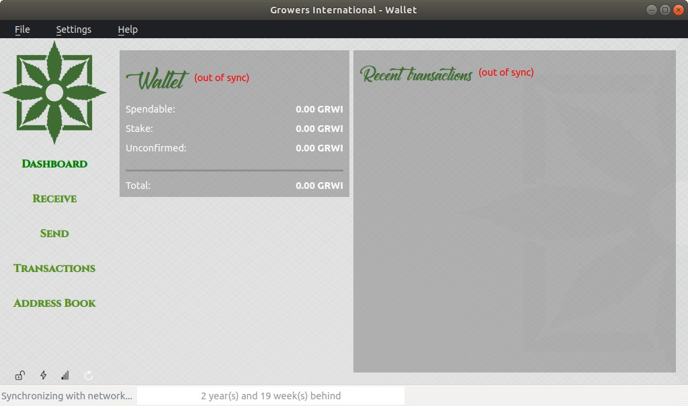

GrowersCoin desktop wallet build instructions
=============================================

Debian/Ubuntu
-------------



First, make sure that the required packages for Qt5 development of your
distribution are installed, for Debian and Ubuntu these are:

```sh
sudo apt-get install build-essential libssl-dev libdb++-dev libboost-all-dev libminiupnpc-dev qt4-default
```

You'll need to download the `libqrcode` package and build it enabling the static mode or the wallet wont compile:

```sh
sudo su
cd /usr/src
apt-get install -y autoconf automake autotools-dev libtool pkg-config libpng12-dev
wget https://fukuchi.org/works/qrencode/qrencode-4.0.2.tar.gz
tar zxvf qrencode-4.0.2.tar.gz
cd qrencode-4.0.2
./configure --enable-static
make
make install
ldconfig
exit
```

Then execute the following:

```
qmake growers-qt.pro USE_UPNP=1 USE_QRCODE=1 RELEASE=1
make
strip growers-qt
```

An executable named `growers-qt` will be built.


Build configuration options
============================

UPNnP port forwarding
---------------------

To use UPnP for port forwarding behind a NAT router (recommended, as more connections overall allow for a faster and more stable growers experience), pass the following argument to qmake:

```sh
qmake "USE_UPNP=1"
```

This requires miniupnpc for UPnP port mapping.  It can be downloaded from
http://miniupnp.tuxfamily.org/files/.  UPnP support is not compiled in by default.

Set USE_UPNP to a different value to control this:

```
+------------+--------------------------------------------------------------------------+
| USE_UPNP=- | no UPnP support, miniupnpc not required;                                 |
+------------+--------------------------------------------------------------------------+
| USE_UPNP=0 | (the default) built with UPnP, support turned off by default at runtime; |
+------------+--------------------------------------------------------------------------+
| USE_UPNP=1 | build with UPnP support turned on by default at runtime.                 |
+------------+--------------------------------------------------------------------------+
```

Notification support for recent (k)ubuntu versions
---------------------------------------------------

To see desktop notifications on (k)ubuntu versions starting from 10.04, enable usage of the
FreeDesktop notification interface through DBUS using the following qmake option:

```sh
qmake "USE_DBUS=1"
```

Generation of QR codes
-----------------------

**Note:** this feature is currently unsupported on Mac.

`libqrencode` may be used to generate QRCode images for payment requests. 
It can be downloaded from http://fukuchi.org/works/qrencode/index.html.en or installed via your package manager.
Pass the `USE_QRCODE` flag to qmake to control this:

```
+--------------+--------------------------------------------------------------------------+
| USE_QRCODE=0 | (the default) No QRCode support - libarcode not required                 |
+--------------+--------------------------------------------------------------------------+
| USE_QRCODE=1 | QRCode support enabled                                                   |
+--------------+--------------------------------------------------------------------------+
```

Berkely DB version warning
==========================

A warning for people using the *static binary* version of Growers on a Linux/UNIX-ish system
(tl;dr: **Berkely DB databases are not forward compatible**).

The static binary version of Growers is linked against libdb 5.0
(see also [this Debian issue](http://bugs.debian.org/cgi-bin/bugreport.cgi?bug=621425)).

Now the nasty thing is that databases from 5.X are not compatible with 4.X.

If the globally installed development package of Berkely DB installed on your system is 5.X, any source you
build yourself will be linked against that. The first time you run with a 5.X version the database will be upgraded,
and 4.X cannot open the new format. This means that you cannot go back to the old statically linked version without
significant hassle!


Ubuntu 11.10 warning
====================

Ubuntu 11.10 has a package called 'qt-at-spi' installed by default.  At the time of writing, having that package
installed causes growers-qt to crash intermittently.  The issue has been reported as
[launchpad bug 857790](https://bugs.launchpad.net/ubuntu/+source/qt-at-spi/+bug/857790).

If this bug hits you, you can remove the `qt-at-spi` package to work around the problem, though this will presumably
disable screen reader functionality for Qt apps:

```sh
sudo apt-get remove qt-at-spi
```
