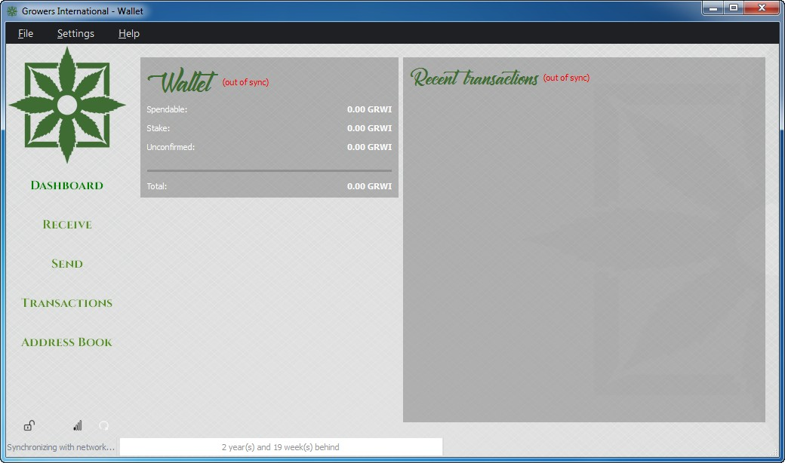

GrowersCoin desktop wallet build instructions
=============================================

Windows
--------



GrowersCoin releases are cross-compiled on an **Ubuntu Linux 16 server** using the **M Cross Environment** (also
known as **[MXE](https://mxe.cc/)**). Following these steps you can build your wallet in a few hours.

> We strongly recommend you to build an Ubuntu 16 Server on VirtualBox or VMWare Player.  
> Give it at least two cores, 4 GB of RAM and 20 GB on disk. 4GB RAM and 4 cores work better.

1. Login into the VM and become root:

    ```
   sudo -i
   ```

2. Download all requirements:
    
    ```sh
    apt-get install -y p7zip-full autoconf automake autopoint bash bison bzip2 cmake flex gettext git g++ gperf
    apt-get install -y intltool libffi-dev libtool libltdl-dev libssl-dev libxml-parser-perl make openssl patch
    apt-get install -y perl pkg-config python ruby scons sed unzip wget xz-utils lzip
    apt-get install -y g++-multilib libc6-dev-i386
    apt-get install -y libtool libtool-bin
    apt-get install -y libgtk2.0-dev
    ```

3. Clone the MXE repository into `/mnt`:
    
   ```sh
   cd /mnt
   git clone https://github.com/mxe/mxe.git
   ```
4. Clone the GrowersCoin repository. It comes with some scripts that will help compiling some of the packages:
    
   ```sh
   cd /mnt
   git clone https://github.com/growersintl/growers.git
   ```

5. Download and build Boost:

   ```sh
   cd /mnt/mxe
   make MXE_TARGETS="i686-w64-mingw32.static" boost
   ```
    **Note**: this will take a couple of hours or more, depending on your machine speed.

6. Build Berkeley DB:

   ```sh
   cd /mnt
   wget http://download.oracle.com/berkeley-db/db-5.3.28.tar.gz
   tar zxvf db-5.3.28.tar.gz
   cd db-5.3.28
   ../growers/mxe-build-db.sh
   cd ..
   ```

7. (Optional) Build Mini UPNP client:

   ```sh
   cd /mnt
   wget http://miniupnp.free.fr/files/miniupnpc-1.6.20120509.tar.gz
   tar zxvf miniupnpc-1.6.20120509.tar.gz
   cd miniupnpc-1.6.20120509
   ../growers/mxe-build-upnp.sh
   cd ..
   ```

8. (Optional) Build QRencode library:

   ```sh
   cd /mnt/mxe
   make MXE_TARGETS="i686-w64-mingw32.static" libqrencode
   ```

9. Build QT:

   ```sh
   cd /mnt/mxe
   make MXE_TARGETS="i686-w64-mingw32.static" qt
   ```
   
   Note: this will take 3-4 hours or more, depending on your machine speed.

10. Downgrade OpenSSL to 1.0:

    ```sh
    cd /mnt/mxe
    make openssl1.0 MXE_TARGETS="i686-w64-mingw32.static" MXE_PLUGIN_DIRS=plugins/examples/openssl1.0/
    ```
   
    This step is important because OpenSSL 1.1 causes an issue that prevents the wallet from compiling.
   
11. Build LevelDB:

    ```sh
    cd /mnt/growers/src/leveldb
    TARGET_OS=OS_WINDOWS_CROSSCOMPILE CC=/mnt/mxe/usr/bin/i686-w64-mingw32.static-gcc \
        CXX=/mnt/mxe/usr/bin/i686-w64-mingw32.static-g++ make libleveldb.a libmemenv.a
    cd /mnt/growers
    ```

12. Do this **once**:

    To avoid the compilation breaking with the next error:
    
    ```
    mnt/mxe/usr/i686-w64-mingw32.static/include/boost/type_traits/detail/has_binary_operator.hp:50: Parse error at "BOOST_JOIN"
    Makefile.Release:810: recipe for target 'build/rpcconsole.moc' failed
    make: *** [build/rpcconsole.moc] Error 1
    ```
    
    You will need to edit the `has_binary_operator.hpp` file by running:
    
    ```sh
    nano /mnt/mxe/usr/i686-w64-mingw32.static/include/boost/type_traits/detail/has_binary_operator.hpp
    ```
    
    Once opened, add this line **at the top of the file**:
    
    ```cpp
    #ifndef Q_MOC_RUN
    ```
    
    Then go **to the end of the file** and add this line:
    
    ```cpp
    #endif
    ```
    
    Press `Ctrl-X`, save and exit, then try rebuilding again. It should go fine.

13. Build GrowersCoin:
    
    By default, UPNP and QRCODE are included in the building script, which can be edited with `nano`:
    
    ```sh
    nano /mnt/growers/mxe-build-growers-qt.sh
    ```
        
    * If you **do not want** QRCODE, go to line 14 and change `USE_QRCODE=1` to `USE_QRCODE=0`
    * If you **do not want** UPNP, go to line 15 and change `USE_UPNP=1` to `USE_UPNP=-`
    
    Once you make those changes, press `Ctrl-X` to save and exit.
    
    **Now compile the wallet:**
    
    ```sh
    cd /mnt/growers
    ./mxe-build-growers-qt.sh
    ```
   
If no errors are found, you can find the `growers-qt.exe` file on `/mnt/growers/release`,
and you can get it in your Windows desktop with a file transfer utility like [WinSCP](https://winscp.net/).

Build configuration options
============================

UPNnP port forwarding
---------------------

To use UPnP for port forwarding behind a NAT router (recommended, as more connections overall allow for a faster and more stable growers experience), pass the following argument to qmake:

```sh
qmake "USE_UPNP=1"
```

This requires miniupnpc for UPnP port mapping.  It can be downloaded from
http://miniupnp.tuxfamily.org/files/.  UPnP support is not compiled in by default.

Set USE_UPNP to a different value to control this:

```
+------------+--------------------------------------------------------------------------+
| USE_UPNP=- | no UPnP support, miniupnpc not required;                                 |
+------------+--------------------------------------------------------------------------+
| USE_UPNP=0 | (the default) built with UPnP, support turned off by default at runtime; |
+------------+--------------------------------------------------------------------------+
| USE_UPNP=1 | build with UPnP support turned on by default at runtime.                 |
+------------+--------------------------------------------------------------------------+
```

Generation of QR codes
-----------------------

`libqrencode` may be used to generate QRCode images for payment requests. 
It can be downloaded from http://fukuchi.org/works/qrencode/index.html.en or installed via your package manager.
Pass the `USE_QRCODE` flag to qmake to control this:

```
+--------------+--------------------------------------------------------------------------+
| USE_QRCODE=0 | (the default) No QRCode support - libarcode not required                 |
+--------------+--------------------------------------------------------------------------+
| USE_QRCODE=1 | QRCode support enabled                                                   |
+--------------+--------------------------------------------------------------------------+
```

Berkely DB version warning
==========================

A warning for people using the *static binary* version of Growers on a Linux/UNIX-ish system
(tl;dr: **Berkely DB databases are not forward compatible**).

The static binary version of Growers is linked against libdb 5.0
(see also [this Debian issue](http://bugs.debian.org/cgi-bin/bugreport.cgi?bug=621425)).

Now the nasty thing is that databases from 5.X are not compatible with 4.X.

If the globally installed development package of Berkely DB installed on your system is 5.X, any source you
build yourself will be linked against that. The first time you run with a 5.X version the database will be upgraded,
and 4.X cannot open the new format. This means that you cannot go back to the old statically linked version without
significant hassle!
